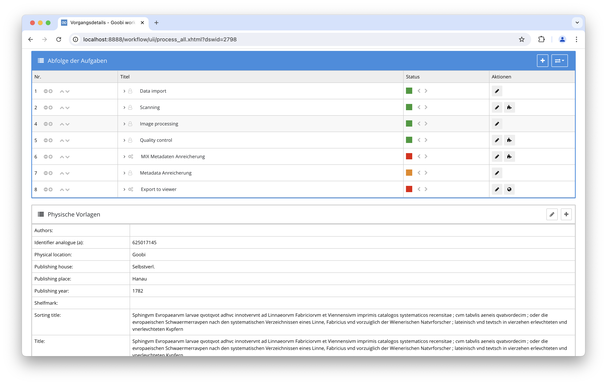
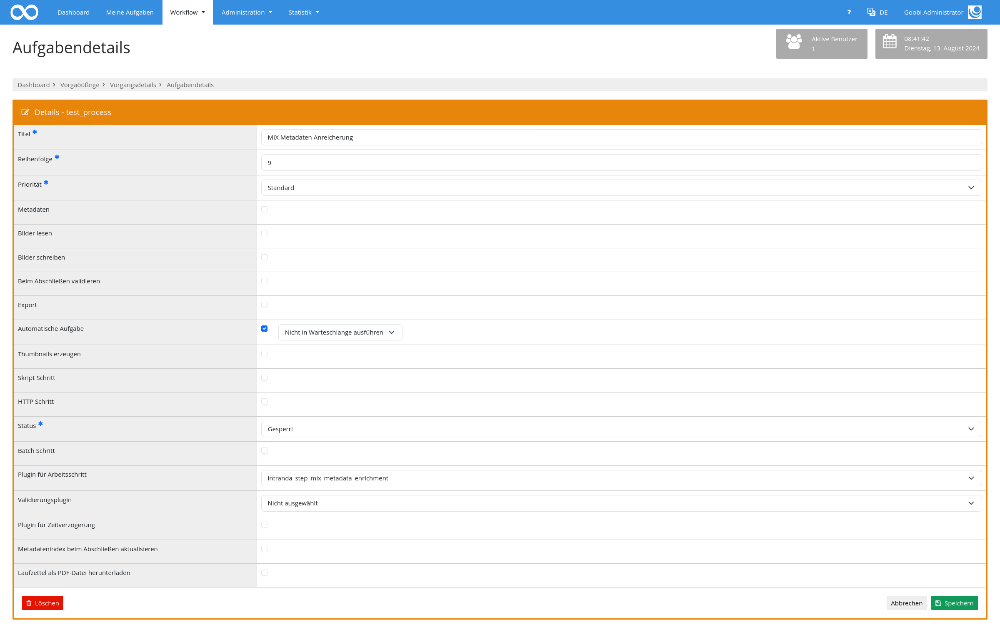

## Einführung
Diese Dokumentation erläutert das Plugin zum MIX Metadata anreichern.

## Installation
Um das Plugin nutzen zu können, müssen folgende Dateien installiert werden:

```bash
/opt/digiverso/goobi/plugins/step/plugin-step-mix-metadata-enrichment-base.jar
/opt/digiverso/goobi/config/plugin_intranda_step_mix_metadata_enrichment.xml
/opt/digiverso/goobi/config/jhove/jhove.conf
```

Nach der Installation des Plugins kann dieses innerhalb des Workflows für die jeweiligen Arbeitsschritte ausgewählt und somit automatisch ausgeführt werden. Ein Workflow könnte dabei beispielhaft wie folgt aussehen:



Für die Verwendung des Plugins muss dieses in einem Arbeitsschritt ausgewählt sein:




## Überblick und Funktionsweise
Wenn das Plugin ausgeführt wird, werden alle Bilddateien in den konfigurierten Ordnern mit JHove analysiert und die technischen Metadaten im MIX Format extrahiert.
Diese technischen Metadaten werden dann in der Mets Datei des Vorgangs hinzugefügt und dort mit den jeweiligen Bilddateien verlinkt.


## Konfiguration
Die Konfiguration des Plugins erfolgt in der Datei `plugin_intranda_step_mix_metadata_enrichment.xml` wie hier aufgezeigt:

{{CONFIG_CONTENT}}

{{CONFIG_DESCRIPTION_PROJECT_STEP}}

Parameter               | Erläuterung
------------------------|------------------------------------
`folder`                | Angabe des Ordners, der von JHove analysiert werden soll um technische Metadaten zu extrahieren. <br /><br />Es können mehrere Ordner angegeben werden, indem das `<folder>` Element wiederholt wird. Der Wert `*` kann verwendet werden, um alle Standardordner auszuwählen.
`jhoveConfig`           | Der Pfad zur JHove Konfigurationsdatei. Eine Beispielkonfiguration liegt dem Plugin bei.
