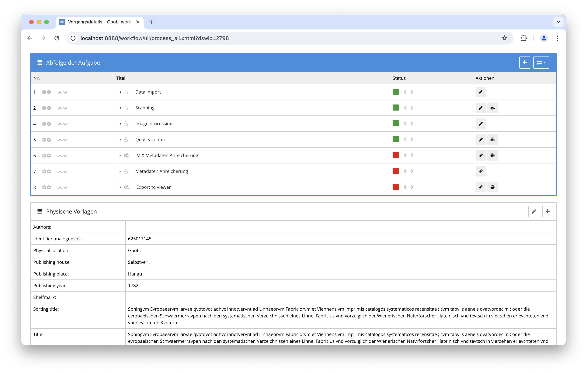
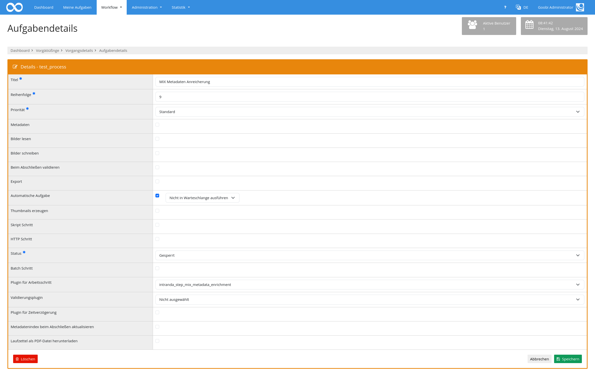

## Einführung
Diese Dokumentation erläutert das Plugin zum MIX Metadata anreichern.

## Installation
Um das Plugin nutzen zu können, müssen folgende Dateien installiert werden:

```bash
/opt/digiverso/goobi/plugins/step/plugin-step-mix-metadata-enrichment-base.jar
/opt/digiverso/goobi/config/plugin_intranda_step_mix_metadata_enrichment.xml
/opt/digiverso/goobi/config/jhove/jhove.conf
```

Nach der Installation des Plugins kann dieses innerhalb des Workflows für die jeweiligen Arbeitsschritte ausgewählt und somit automatisch ausgeführt werden. Ein Workflow könnte dabei beispielhaft wie folgt aussehen:



Für die Verwendung des Plugins muss dieses in einem Arbeitsschritt ausgewählt sein:




## Überblick und Funktionsweise
Wenn das Plugin ausgeführt wird, werden alle Bilddateien in den konfigurierten Ordnern mit JHove analysiert und die technischen Metadaten im MIX Format extrahiert.
Diese technischen Metadaten werden dann in der Mets Datei des Vorgangs hinzugefügt und dort mit den jeweiligen Bilddateien verlinkt.


## Konfiguration
Die Konfiguration des Plugins erfolgt in der Datei `plugin_intranda_step_mix_metadata_enrichment.xml` wie hier aufgezeigt:

{{CONFIG_CONTENT}}

{{CONFIG_DESCRIPTION_PROJECT_STEP}}

Parameter               | Erläuterung                                                                                                                                                                                                                                                                                                                                                                           
------------------------|---------------------------------------------------------------------------------------------------------------------------------------------------------------------------------------------------------------------------------------------------------------------------------------------------------------------------------------------------------------------------------------
`folder`                | Angabe des Ordners, der von JHove analysiert werden soll um technische Metadaten zu extrahieren. <br /><br />Der konfigurierte Ordner wird verwendet, um die technischen Metadaten in Mets zu speichern. Es können durchaus `master` Bilder analysiert und Derivate dann um technische Metadaten ergänzt werden.                                                                      
`jhoveConfig`           | Der Pfad zur JHove Konfigurationsdatei. Eine Beispielkonfiguration liegt dem Plugin bei.                                                                                                                                                                                                                                                                                              
`renameMappings`        | In diesem Element können beliebig viele Umbenennungen in MIX definiert werden.<br /><br />Die Kindelemente müssen folgende Form haben: `<value from="a/b/c" to="d/e" removeEmptyParents="true\|false"/>`. Das Element `c`, welches in MIX in der Hierarchie `a/b/c` steht, wird in `e` als Kindelement von `d` umbenannt. Wenn `removeEmptyParents` auf `true` gesetzt ist, werden sowohl `b` als auch `a` entfernt, wenn sie keine weiteren Kindelemente haben.<br /><br />Das kann beispielsweise nützlich sein, wenn Daten in MIX vorhersehbar in den falschen Feldern stehen (Kamera wird als Scanner erkannt): `<value from="ImageCaptureMetadata/ScannerCapture/scannerManufacturer" to="ImageCaptureMetadata/DigitalCameraCapture/digitalCameraManufacturer" removeEmptyParents="true"/>`. 
`extraMappings`         | In diesem Element können beliebig viele MIX-Zusatzfelder definiert werden, die von JHove nicht automatisch korrekt erkannt werden.<br /><br />Die Kindelemente müssen folgende Form haben: `<value source="//some/xpath" target="a/b/c" transform="TRANSFORM"/>`. `source` enthält einen XPath Ausdruck zu einem Wert, der im JHove Ergebnis zu finden ist. `target` enthält den Pfad in MIX, wo der Wert gespeichert werden soll. `transform` kann optional angegeben werden, wenn eine Wertkonvertierung erforderlich ist. Es gibt aktuell zwei mögliche Konvertierung: `rational2real` und `rational2rationalType`. `rational2real` wandelt Brüche in Zahlen mit Punkt um (bspw. `1/4` zu `0.25`). `rational2rationalType` wandelt Brüche in einen speziellen MIX-Typen für Brüche um.<br /><br />Um zusätzlich die Blende zu speichern, könnte man sowas konfigurieren: `<value source="//jhove:property[jhove:name='FNumber']//jhove:value[1]" target="ImageCaptureMetadata/DigitalCameraCapture/CameraCaptureSettings/ImageData/fNumber" transform="rational2real"/>`. 