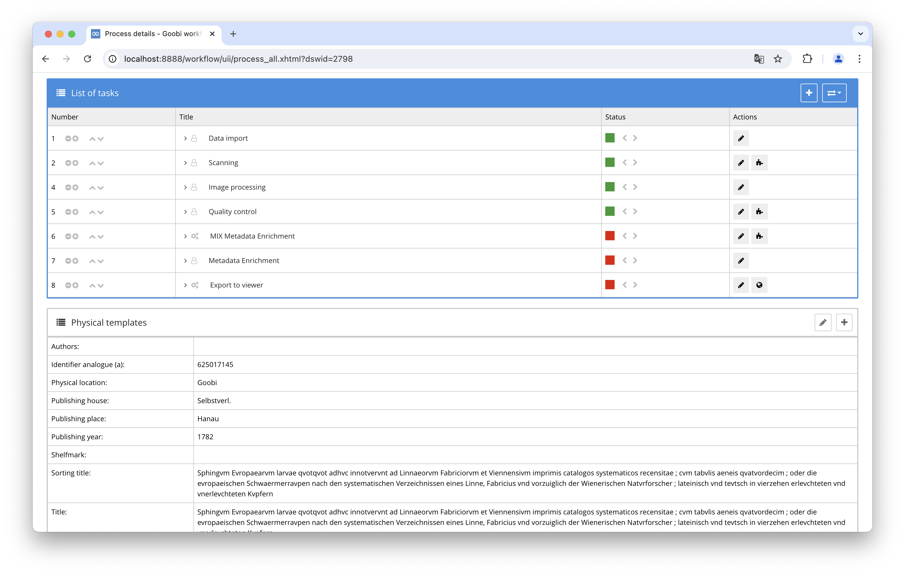

## Introduction
This documentation explains the plugin for enriching MIX Metadata.

## Installation
To be able to use the plugin, the following files must be installed:

```bash
/opt/digiverso/goobi/plugins/step/plugin-step-mix-metadata-enrichment-base.jar
/opt/digiverso/goobi/config/plugin_intranda_step_mix_metadata_enrichment.xml
/opt/digiverso/goobi/config/jhove/jhove.conf
```

Once the plugin has been installed, it can be selected within the workflow for the respective work steps and thus executed automatically. A workflow could look like the following example:



To use the plugin, it must be selected in a workflow step:


## Overview and functionality
When the plugin is executed, all image files in the configured folders are analyzed with JHove and the technical metadata is extracted in MIX format.
This technical metadata is then added to the Mets file of the process and linked there to the respective image files.


## Configuration
The plugin is configured in the file `plugin_intranda_step_mix_metadata_enrichment.xml` as shown here:

{{CONFIG_CONTENT}}

{{CONFIG_DESCRIPTION_PROJECT_STEP}}

Parameter               | Explanation
------------------------|------------------------------------
`folder`                | Specifies the folder to be analyzed by JHove to extract technical metadata. <br /><br />Multiple folders can be specified by repeating the `<folder>` element. The value `*` can be used to select all default folders.
`jhoveConfig`           | The path to the JHove configuration file. A sample configuration is included with the plugin.
